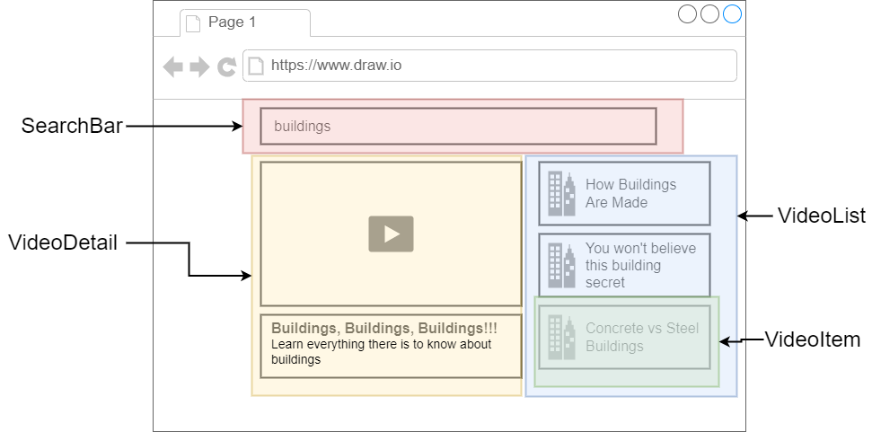
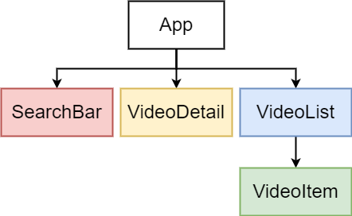
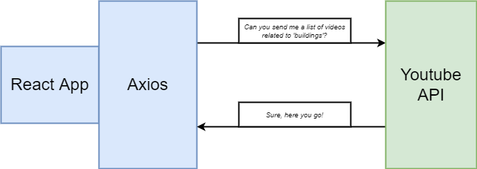
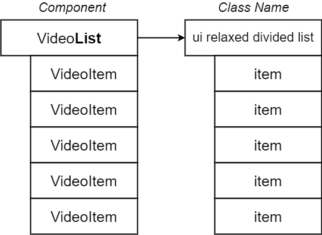
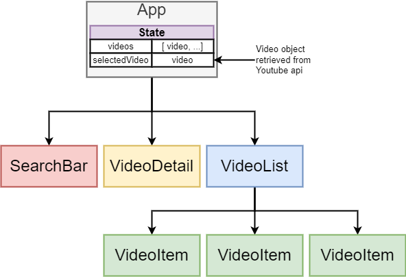
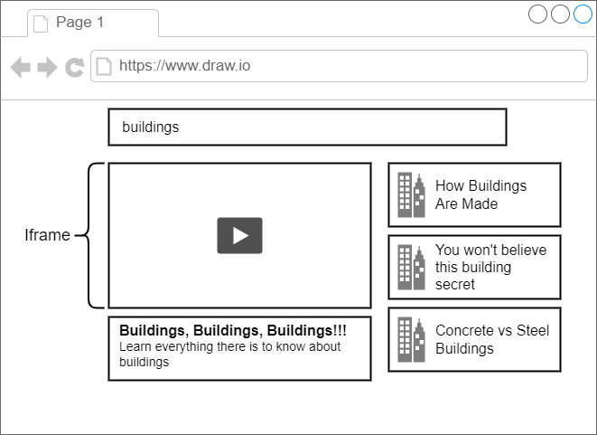

<!-- vscode-markdown-toc -->
* 1. [App Mockup](#AppMockup)
* 2. [What it does](#Whatitdoes)
* 3. [Hierarchy](#Hierarchy)
* 4. [API](#API)
* 5. [Video](#Video)
* 6. [Select](#Select)
* 7. [ Selection](#Selection)
* 8. [iFrame](#iFrame)

<!-- vscode-markdown-toc-config
	numbering=true
	autoSave=true
	/vscode-markdown-toc-config -->
<!-- /vscode-markdown-toc -->

# About

This project is fully based on the Udemy Course [Modern React with Redux](https://www.udemy.com/course/react-redux/).

##  1. App Mockup

##  2. What it does

This App is searching for youtube videos based on the given searchterm.
The result is limited to five videos while the starting search term while opening the app is "building".

##  3. Hierarchy

##  4. API

Get API-Key:
[Google Developers](console.developers.google.com)

[API-Documentation](https://developers.google.com/youtube/v3/docs/search/list)

##  5. Video

##  6. Select

##  7.  Selection

##  8. iFrame

