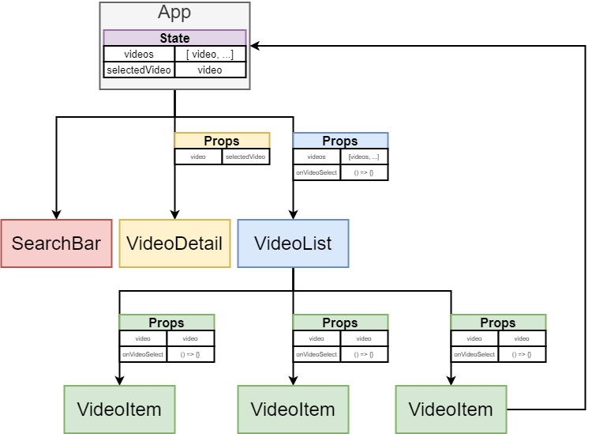

<!-- vscode-markdown-toc -->
* 1. [Hierarchy](#Hierarchy)
* 2. [API](#API)
* 3. [Video](#Video)
* 4. [Select](#Select)
* 5. [ Selection](#Selection)
* 6. [iFrame](#iFrame)

<!-- vscode-markdown-toc-config
	numbering=true
	autoSave=true
	/vscode-markdown-toc-config -->
<!-- /vscode-markdown-toc -->

# App Mockup

##  1. Hierarchy

##  2. API

Get API-Key:
[Google Developers](console.developers.google.com)

[API-Documentation](https://developers.google.com/youtube/v3/docs/search/list)

##  3. Video

##  4. Select

##  5.  Selection

##  6. iFrame

